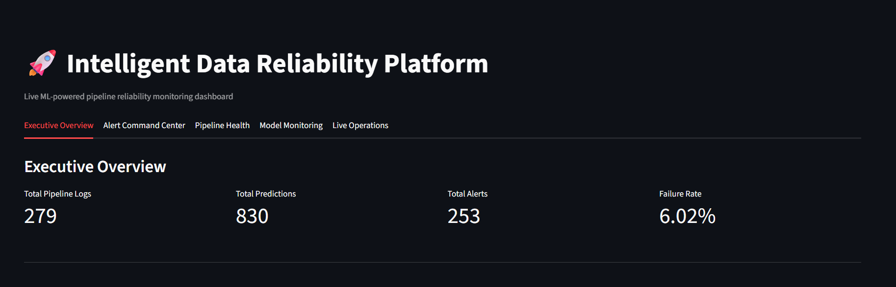
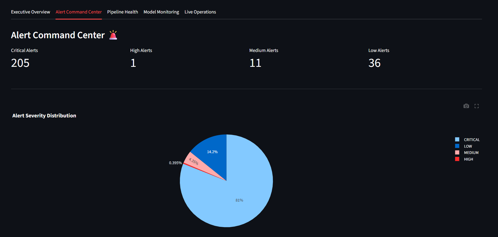
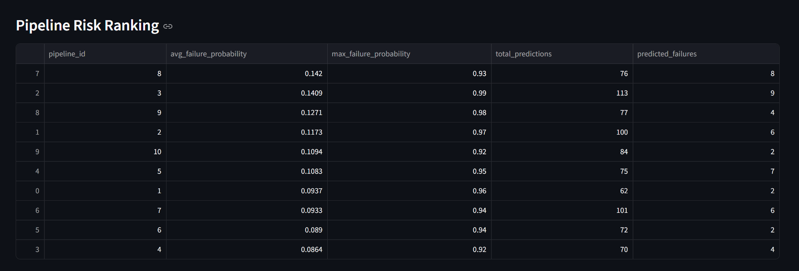
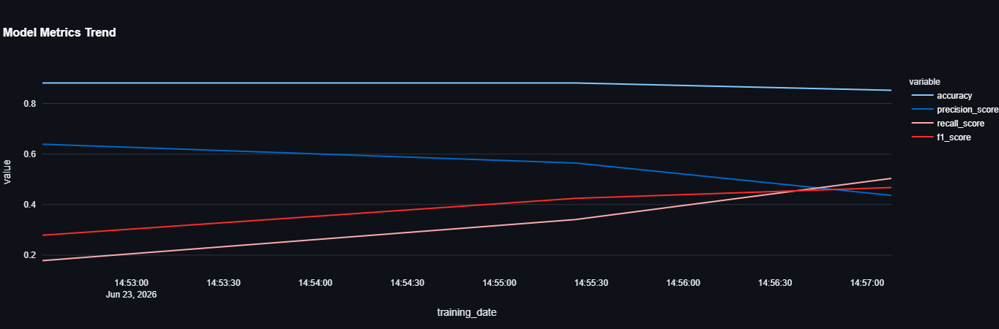
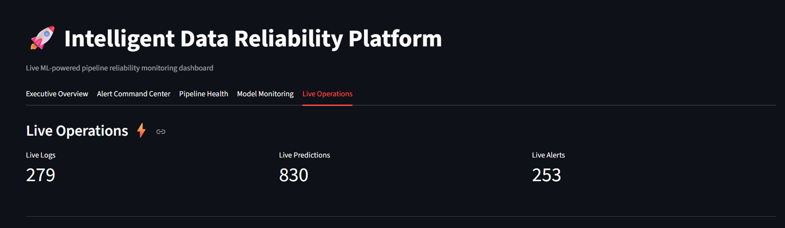

# 🚀 Intelligent Data Reliability Platform

## 📌 Overview

The Intelligent Data Reliability Platform is an end-to-end Machine Learning and Data Engineering project designed to proactively detect pipeline failures before they impact downstream systems.

The platform simulates live data pipelines, predicts failure risks using a Machine Learning model, generates operational alerts, stores monitoring information in MySQL, and visualizes system health through an interactive Streamlit dashboard.

This project demonstrates practical concepts from:

* Machine Learning
* Data Engineering
* MLOps
* Data Reliability Engineering
* Real-Time Monitoring
* Dashboard Development

---

# 🎯 Problem Statement

Modern data pipelines are critical for analytics, reporting, and machine learning systems.

Pipeline failures can cause:

* Missing reports
* Delayed analytics
* Data quality issues
* Business disruptions

The objective of this project is to identify potential failures before they occur and provide real-time operational visibility.

---

# 🏗️ System Architecture

```text
Live Pipeline Simulator
          ↓
Feature Generation
          ↓
Failure Prediction Model
          ↓
Alert Generation Engine
          ↓
MySQL Storage Layer
          ↓
Streamlit Monitoring Dashboard
```

---

# ✨ Features

## 🤖 Failure Prediction

* Random Forest based prediction engine
* Failure probability scoring
* Real-time predictions
* Threshold-based risk detection

## 🚨 Alert Management

* Automatic alert generation
* Severity classification
* Alert history tracking
* High-risk pipeline identification

## 🗄️ Database Integration

* MySQL storage
* Historical monitoring records
* Prediction tracking
* Model metrics tracking

## 📊 Monitoring Dashboard

* Executive Overview
* Alert Command Center
* Pipeline Health Monitoring
* Model Performance Monitoring
* Live Operations Monitoring

## ⚡ Live Monitoring

* Continuous pipeline simulation
* Live prediction generation
* Automatic dashboard refresh
* Real-time operational insights

---

# 🛠️ Technology Stack

### Programming

* Python

### Machine Learning

* Scikit-Learn
* Random Forest Classifier

### Data Processing

* Pandas
* NumPy

### Database

* MySQL

### Dashboard

* Streamlit
* Plotly

### Environment Management

* Python Virtual Environment
* python-dotenv

---

# 📂 Project Structure

```text
Intelligent-Data-Reliability-Platform/

├── dashboard/
│   └── app.py
│
├── data/
│   ├── labeled_pipeline_logs.csv
│   └── pipeline_logs.csv
│   
│
├── models/
│   └── failure_prediction_model.pkl
│
├── Screenshots/
│   ├── dashboard_overview.png
│   ├── alert_severity_distribution.png
│   ├── pipeline_risk_ranking.png
│   ├── model_metrics.png
│   └── live_operation_kpis.png
│
├── sql/
│   └── database_setup.sql
│
├── src/
│   ├── alert_summary.py
│   ├── batch_predict.py
│   ├── create_labels.py
│   ├── db_connection.py
│   ├── generate_alerts.py
│   ├── generate_dataset.py
│   ├── generate_pipeline_logs.py
│   ├── live_alert_stream.py
│   ├── live_pipeline_simulator.py
│   ├── live_predictor.py
│   ├── predict_failure.py
│   ├── run_system.py
│   └── train_model.py
│
├── .env.example
├── .gitignore
├── requirements.txt
└── README.md
```
📁 Generated Outputs

The following files are generated automatically while the system is running:

live_pipeline_logs.csv
live_predictions.csv
live_alerts.csv
predicted_pipeline_failures.csv
failure_alerts.csv

These files are excluded from version control to keep the repository clean and focused on source code, training data, and project artifacts.
---

# 📈 Model Performance

| Metric    | Value  |
| --------- | ------ |
| Accuracy  | 85.20% |
| Precision | 43.62% |
| Recall    | 50.39% |
| F1 Score  | 46.76% |

The model was tuned to improve failure detection recall, prioritizing operational reliability over pure accuracy.

---

# 📊 Dashboard Modules

## Executive Overview

* Total Pipeline Logs
* Total Predictions
* Total Alerts
* Failure Rate
* Execution Time Trend
* Failure Probability Trend

## Alert Command Center

* Alert Severity Distribution
* Alert Volume Trend
* Top Alerting Pipelines
* Latest Alerts

## Pipeline Health

* Pipeline Risk Ranking
* Average Failure Probability by Pipeline
* Average Execution Time by Pipeline
* Recent Predictions

## Model Monitoring

* Accuracy Tracking
* Precision Tracking
* Recall Tracking
* F1 Score Tracking
* Training History

## Live Operations

* Live Logs
* Live Predictions
* Live Alerts
* Real-Time Monitoring

---

# 📸 Dashboard Screenshots

## Dashboard Overview



## Alert Command Center



## Pipeline Health



## Model Monitoring



## Live Operations



---

# ⚙️ Installation

## Clone Repository

```bash
git clone <repository-url>
cd Intelligent-Data-Reliability-Platform
```

## Create Virtual Environment

```bash
python -m venv venv
```

## Activate Environment

### Windows

```bash
venv\Scripts\activate
```

## Install Dependencies

```bash
pip install -r requirements.txt
```

---

# 🔐 Environment Variables

Create a `.env` file:

```env
DB_HOST=localhost
DB_USER=root
DB_PASSWORD=your_password
DB_NAME=reliability_platform
```

---

# 🗄️ Database Setup

Execute:

```sql
sql/database_setup.sql
```

This creates:

* reliability_platform database
* pipeline_logs table
* failure_predictions table
* failure_alerts table
* model_metrics table

---

# ▶️ Running the Project

## Start Live Monitoring System

```bash
python src/run_system.py
```

## Launch Dashboard

```bash
streamlit run dashboard/app.py
```

---

# 🔮 Future Enhancements

* Kafka Integration
* Docker Deployment
* MLflow Model Tracking
* CI/CD Pipeline
* Email & Slack Alerts
* Cloud Deployment (AWS)
* Data Drift Detection
* Production Data Pipeline Integration

---

# 👨‍💻 Author

**Kimaya Paripurna**

AI & Machine Learning | Data Engineering | MLOps

---

# ⭐ Project Highlights

✅ Machine Learning Failure Prediction

✅ Real-Time Pipeline Monitoring

✅ Alert Generation System

✅ MySQL Integration

✅ Streamlit Dashboard

✅ Live Operational Monitoring

✅ MLOps Concepts

✅ End-to-End Data Reliability Platform

